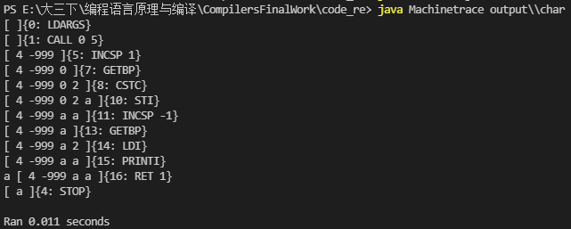
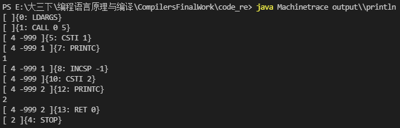
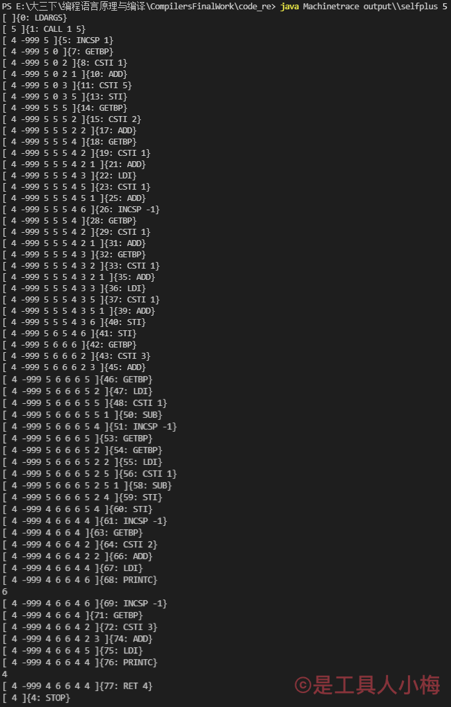
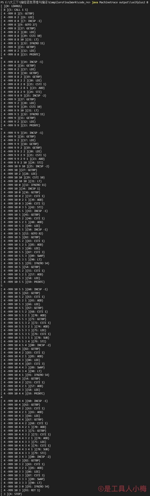
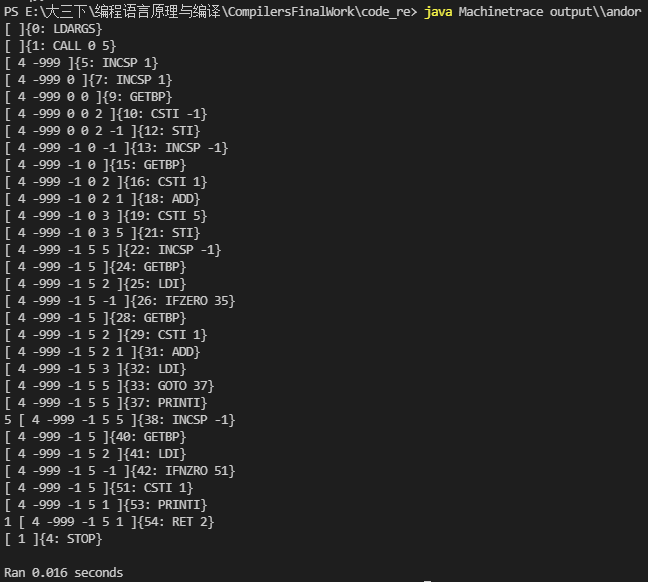
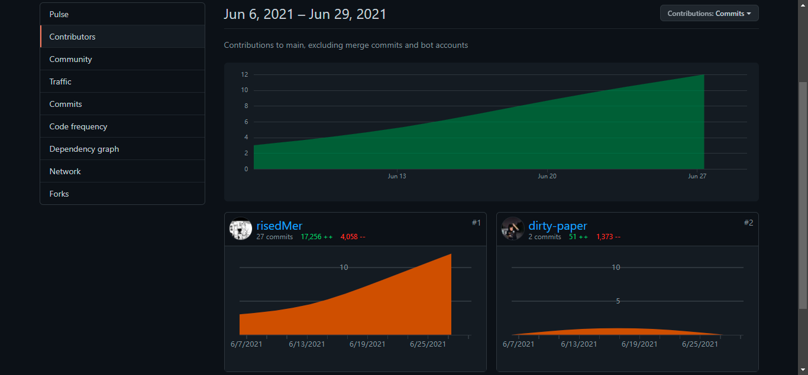

# [2020-2021学年第2学期](http://sigcc.gitee.io/plc2021/#/lab/proj.final?id=_2020-2021学年第2学期)

# [**实 验 报 告**](http://sigcc.gitee.io/plc2021/#/lab/proj.final?id=实-验-报-告)


- 课程名称:编程语言原理与编译
- 实验项目:期末大作业
- 专业班级 <u>计算机1802</u>
- 学生学号 <u>31801120 31801112</u>
- 学生姓名 <u>梅景添 项伟铭</u>
- 实验指导教师:郭鸣

## 项目简介

## 结构

- 前端：由F#语言编写
  - XMAbsyn.fs        抽象语法树
  - XMPar.fsy           fsyacc语法定义
  - XMLex.fsl            fslex词法定义
  - XMContcomp.fs  编译器
  - XM.fsproj             编译器项目文件

- 后端：有java语言编写

  - Machine.java       java后端

### 项目运行方式

```F#
# 编译编译器
dotnet build XM.fsproj

# 执行编译器
#r "nuget: FsLexYacc";;
#load "XMAbsyn.fs" "XMPar.fs" "XMLex.fs" "Debug.fs" "Parse.fs" "XMMachine.fs" "Backend.fs" "XMContcomp.fs" "ParseAndComp.fs";;
open ParseAndComp;;
Debug.debug <-  true;;
compileToFile (fromFile "test\\xxx.c") "output\\xxx";;

# 编译java后端
javac Machine.java

# 执行java后端
java Machine output\\xxx			-- 运行
java Machinetrace output\\xxx		-- 运行并输出堆栈信息
```

### 功能实现

- 实现各种形式注释注释

  测试代码

  ```c
  void main(int n) {
      /*这里是注释*/
      (*这里也是注释*)
      <!-- 这里也是注释 -->
      /*
          这是多行注释
      */
      (*
          这里也是多行注释
      *)
      <!--
          这里也是多行注释
      -->
      /* print n */
      (* print n *)
      // 这是单行注释
  }
  ```

  运行堆栈结果

  

  对比空函数的堆栈

  

- float类实现

  测试代码

  ```c
  void main(int n) {
      float x;
      x = 5.5;
      float y;
      y = 2.2;
      float z;
      z = x + y;
      print z;
      z = x - y;
      print z;
      z = x * y;
      print z;
      z = x / y;
      print z;
      return 0;
  }
  ```

  运行堆栈结果

  

- sleep 方法实现

  测试代码

  ```C
  void main(int n) {
      sleep(n);
  }
  ```

  运行堆栈图

  

- do-while实现

  测试代码

  ```C
  void main(int n) {
      int i;
      i = n - 3;
      do {
          print i;
          i = i + 1;
      } while(i < n);
  }
  ```

  运行堆栈图

  

- for循环实现

  测试代码

  ```c
  void main(int n) {
      for(n;n < 6;n = n + 1) {
          print n;
      }
  }
  ```

  运行堆栈图

  

- char类型实现

  测试代码

  ```C
  void main() {
      char c;
      c = 'a';
      print c;
  }
  ```

  运行堆栈图

  

- println实现

  测试代码

  ```C
  void main() {
      println 1;
      println 2;
  }
  ```

  运行堆栈图

  

- selfplus、selfminus实现

  测试代码1

  ```C
  void main(int n) {
      int i;
      i = 5;
      int x;
      x = ++i;
      int y;
      y = --n;
      println x;
      println y;
  }
  ```

  运行堆栈图

  

  测试代码2

  ```C
  void main(int n) {
      for(n;n < 10;n++) {
          println n;
      }
      int m;
      m = 5;
      for(m;m > 3;m--) {
          println m;
      }
  }
  ```

  运行堆栈图

  
  
- 逻辑运算符 && ||

  测试代码

  ```C
  void main() {
      int a;
      int b;
      a = -1;
      b = 5;
      print a && b;
      print a || b;
  }
  ```

  运行堆栈图

  


| 姓名   | 学号     | 班级       | 任务       | 权重   |
| ------ | -------- | ---------- | ---------- | ------ |
| Name   | No.      | Class      | Task       | Factor |
| 梅景添 | 31801120 | 计算机1802 | 设计、编码 | 1.0    |
| 项伟铭 | 31801112 | 计算机1802 | 测试、编码 | 0.9    |

成员代码提交日志




1. 项目自评等级:(1-5) 请根据自己项目情况填写下表

| 词法                              | 评分  | 备注                    |
| --------------------------------- | ----- | ----------------------- |
| 注释 // /**/ (\*\*) <\!\-\- \-\-> | ⭐     |                         |
| 循环 do-while                     | ⭐     |                         |
| 改进 print → println              | ⭐     |                         |
| 类型 char                         | ⭐⭐    |                         |
| 逻辑运算符 && \|\|                | ⭐⭐    | X看懂后实现的第一个功能 |
| 类型 float                        | ⭐⭐⭐   | XM一起完成的            |
| 循环 for                          | ⭐⭐⭐   |                         |
| 自增自减                          | ⭐⭐⭐   |                         |
| 线程的 sleep 方法                 | ⭐⭐⭐⭐⭐ | M看懂后实现的第一个功能 |


1. 项目说明
   - 项目 是基于现有的xxx代码

     ```sh
     1. 添加注释 (**) // /**/
     2. 改进了while方法，实现了do-while功能
     3. 改进print方法，实现了println方法
     ```
   
   - 项目 独立开发
   
     ```sh
     1. 完成了sleep()函数的开发
     2. 完成了float类的开发
     3. 实现了char类的开发
     4. 实现了for循环的开发
     5. 实现自增、自减的开发
     6. 实现了逻辑运算符 && ||
     ```
2. 解决技术要点说明
   - 解决 java后端只能对Int类型进行存储的  问题1，关键代码与步骤如下

     ```java
     // 将原来的 int[] 堆栈改为 Object[] 堆栈
     Object[] s = new Object[STACKSIZE];               // The evaluation stack
     // 所有与stack有关的内容均强行进行类型转换
     case ADD: 
     	if((String.valueOf(s[sp-1])).indexOf(String.valueOf(".")) != -1) {
     		s[sp-1] = Float.parseFloat(String.valueOf(s[sp-1])) + Float.parseFloat(String.valueOf(s[sp])); sp--; 
     	}
     	else {
     		s[sp-1] = Integer.parseInt(String.valueOf(s[sp-1])) + Integer.parseInt(String.valueOf(s[sp])); sp--;
     	}
             // s[sp-1] = Integer.parseInt(String.valueOf(s[sp-1])) + Integer.parseInt(String.valueOf(s[sp])); sp--;
     	break;
     case SUB:
     	if((String.valueOf(s[sp-1])).indexOf(String.valueOf(".")) != -1) {
     		s[sp-1] = Float.parseFloat(String.valueOf(s[sp-1])) - Float.parseFloat(String.valueOf(s[sp])); sp--;
     	}
     	else {
     		s[sp-1] = Integer.parseInt(String.valueOf(s[sp-1])) - Integer.parseInt(String.valueOf(s[sp])); sp--;
     	}
             // s[sp-1] = Integer.parseInt(String.valueOf(s[sp-1])) - Integer.parseInt(String.valueOf(s[sp])); sp--; 
     	break;
     case MUL:
     	if((String.valueOf(s[sp-1])).indexOf(String.valueOf(".")) != -1) {
     		s[sp-1] = Float.parseFloat(String.valueOf(s[sp-1])) * Float.parseFloat(String.valueOf(s[sp])); sp--;
     	}
     	else {
     		s[sp-1] = Integer.parseInt(String.valueOf(s[sp-1])) * Integer.parseInt(String.valueOf(s[sp])); sp--;
     	} 
             // s[sp-1] = Integer.parseInt(String.valueOf(s[sp-1])) * Integer.parseInt(String.valueOf(s[sp])); sp--; 
     	break;
     case DIV: 
     	if((String.valueOf(s[sp-1])).indexOf(String.valueOf(".")) != -1) {
     		s[sp-1] = Float.parseFloat(String.valueOf(s[sp-1])) / Float.parseFloat(String.valueOf(s[sp])); sp--;
     	}
     	else {
     		s[sp-1] = Integer.parseInt(String.valueOf(s[sp-1])) / Integer.parseInt(String.valueOf(s[sp])); sp--;
     	}
             // s[sp-1] = Integer.parseInt(String.valueOf(s[sp-1])) / Integer.parseInt(String.valueOf(s[sp])); sp--; 
     	break;
     case MOD: 
     	s[sp-1] = Integer.parseInt(String.valueOf(s[sp-1])) % Integer.parseInt(String.valueOf(s[sp])); sp--; break;
     case EQ:
     	if((String.valueOf(s[sp-1])).indexOf(String.valueOf(".")) != -1) {
     		s[sp-1] = (Float.parseFloat(String.valueOf(s[sp-1])) == Float.parseFloat(String.valueOf(s[sp])) ? 1 : 0); sp--; 
         }
     	else {
     	s[sp-1] = (Integer.parseInt(String.valueOf(s[sp-1])) == Integer.parseInt(String.valueOf(s[sp])) ? 1 : 0); sp--; 
         }
               // s[sp-1] = (Integer.parseInt(String.valueOf(s[sp-1])) == Integer.parseInt(String.valueOf(s[sp])) ? 1 : 0); sp--; 
     	break;
     case LT:
     	if((String.valueOf(s[sp-1])).indexOf(String.valueOf(".")) != -1) { 
     		s[sp-1] = (Float.parseFloat(String.valueOf(s[sp-1])) < Float.parseFloat(String.valueOf(s[sp])) ? 1 : 0); sp--;
     	}
     	else {
     		s[sp-1] = (Integer.parseInt(String.valueOf(s[sp-1])) < Integer.parseInt(String.valueOf(s[sp])) ? 1 : 0); sp--;
     	}
               // s[sp-1] = (Integer.parseInt(String.valueOf(s[sp-1])) < Integer.parseInt(String.valueOf(s[sp])) ? 1 : 0); sp--; 
     	break;
     case NOT: 
     	if((String.valueOf(s[sp-1])).indexOf(String.valueOf(".")) != -1) 
     		s[sp] = (Float.parseFloat(String.valueOf(s[sp])) == 0 ? 1 : 0); 
     	else
     		s[sp] = (Integer.parseInt(String.valueOf(s[sp])) == 0 ? 1 : 0); 
             // s[sp] = (Integer.parseInt(String.valueOf(s[sp])) == 0 ? 1 : 0); 
     	break;
     case DUP: 
     	s[sp+1] = s[sp]; sp++; break;
     case SWAP: 
     	{ Object tmp = s[sp];  s[sp] = s[sp-1];  s[sp-1] = tmp; } break; 
     case LDI:                 // load indirect
     	s[sp] = s[Integer.parseInt(String.valueOf(s[sp]))]; break;
     case STI:                 // store indirect, keep value on top
     	s[Integer.parseInt(String.valueOf(s[sp-1]))] = s[sp]; s[sp-1] = s[sp]; sp--; break;
     ```

   - 解决 float 类型从前端转换后java读取值问题 问题2， 关键代码与步骤如下

     - 前端代码

     ```F#  
     let rec addCSTF i C =
         match (i, C) with
         | _ -> (CSTF (System.BitConverter.ToInt32(System.BitConverter.GetBytes(float32(i)), 0))) :: C
     ```
     - 后端代码
     ```java
     case CSTF: s[sp+1] = new Float(Float.intBitsToFloat(p[pc++])); sp++; break;
     ```
     
     ​	由于机器码只能存储Int类型的值，前端在将float类型读取时转化为32位Int类型，后端在读取时需将其再次转回float类型才能正常显示，在发现值不对劲后，X同学通过手动计算发现是转换的原因，后查询资料获得Flaot.intBitsToFloat方法，解决此问题，最终成功输出正确的float值
     
   - 解决 float 类型数值无法进行四则运算 问题3， 关键代码与步骤如下
   
     ```java
     case ADD: 
     	if((String.valueOf(s[sp-1])).indexOf(String.valueOf(".")) != -1) {
     		s[sp-1] = Float.parseFloat(String.valueOf(s[sp-1])) + Float.parseFloat(String.valueOf(s[sp])); sp--; 
     	}
     	else {
     		s[sp-1] = Integer.parseInt(String.valueOf(s[sp-1])) + Integer.parseInt(String.valueOf(s[sp])); sp--;
     	}
     	break;
     case SUB:
     	if((String.valueOf(s[sp-1])).indexOf(String.valueOf(".")) != -1) {
     		s[sp-1] = Float.parseFloat(String.valueOf(s[sp-1])) - Float.parseFloat(String.valueOf(s[sp])); sp--;
     	}
     	else {
     		s[sp-1] = Integer.parseInt(String.valueOf(s[sp-1])) - Integer.parseInt(String.valueOf(s[sp])); sp--;
     	}
     	break;
     case MUL:
     	if((String.valueOf(s[sp-1])).indexOf(String.valueOf(".")) != -1) {
     		s[sp-1] = Float.parseFloat(String.valueOf(s[sp-1])) * Float.parseFloat(String.valueOf(s[sp])); sp--;
     	}
     	else {
     		s[sp-1] = Integer.parseInt(String.valueOf(s[sp-1])) * Integer.parseInt(String.valueOf(s[sp])); sp--;
     	}  
     	break;
     case DIV: 
     	if((String.valueOf(s[sp-1])).indexOf(String.valueOf(".")) != -1) {
     		s[sp-1] = Float.parseFloat(String.valueOf(s[sp-1])) / Float.parseFloat(String.valueOf(s[sp])); sp--;
     	}
     	else {
     		s[sp-1] = Integer.parseInt(String.valueOf(s[sp-1])) / Integer.parseInt(String.valueOf(s[sp])); sp--;
         }
     	break;
     ```
   
     ​	通过判断读入的数是否存在 "." 来判断读入的是否为float类，若为float就进行float转换，若不是则转换为int。没有以上这一判断，后端运行时若读入float类型的值进行四则运算会报parse错误。
   
3. 心得体会（结合自己情况具体说明）
   - 大项目开发过程心得

     - 项伟铭个人心得

       ```sh
       	计算机领域发展到今天，已经算一个非常蓬勃的状态了，新技术的更迭一次比一次快而且全面，固然新的框架实现的功能迅捷而便利，但是仅掌握这些框架的使用是不能在这个领域生存的。这半年有幸领略了郭老师的编译原理课程，虽然所学不精，但是多少能让浮躁的内心感受到了关于计算机底的层本质的一些奥妙。关于这节课，课堂学来终觉浅，自我求索方得详尽，计算机如此，人生也是如此。
       ```

     - 梅景添个人心得
     
       ```
       	本次改进microc项目，初期进展比较慢，在学习F#的语法上花了不少功夫，在看懂microc的构成文件以及运行的方式之后，慢慢摸索模仿着写了一个sleep()指令之后，才发现其实本次的项目并没有想象中那么的困难，只是由于对F#语言不熟悉而产生它有很大难度的错觉。逐渐的上手之后，开发出一个新功能都有很大的成就感，在float类型的开发过程中，虽然感觉它和int类型没有什么很大的区别，但是却花了两天时间才把它给整出来，后端java部分又出了问题再次花了不少时间，在前期开发的功能上花了很多时间，收获也是不少的，之后的char类型开发就十分快速，慢慢的轻车熟路起来了。本次的项目带来了不少收获，对编译原理也有了更深的理解。感谢本次项目。
       ```
     
   - 本课程建议

     ```sh
     1. 课程难度还是有一定的难度的，对于初次接触它感觉有和其他的课程有很大的不同，基于底层的这些东西在初期学习起来有些抗拒。
     2. 课后作业可以多一些编程方面的题目，像之前布置过的那个F#填空的作业，更有利于我们理解F#
     ```

     