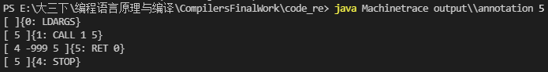
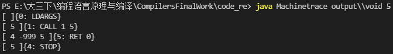
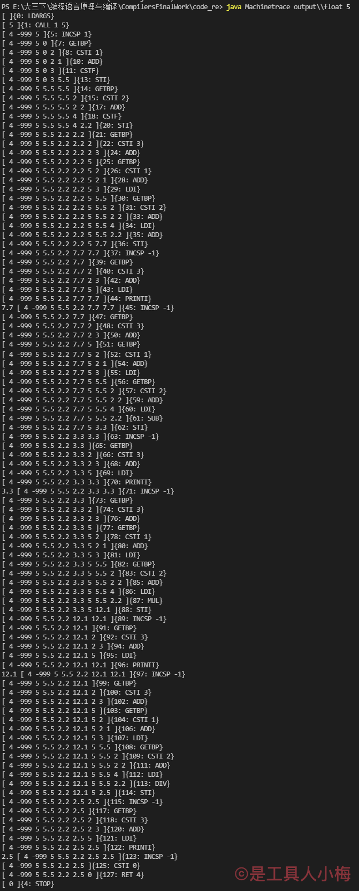
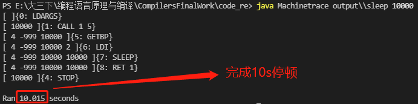
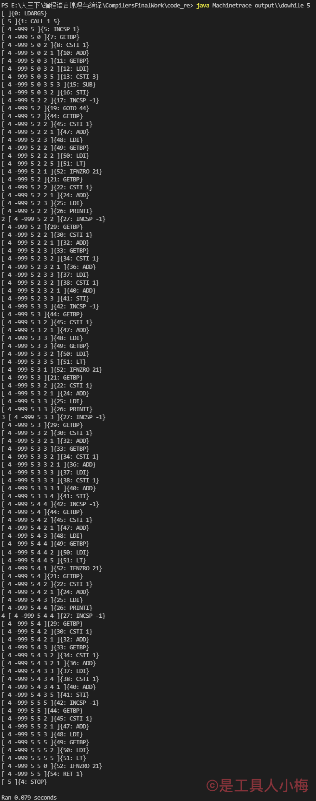
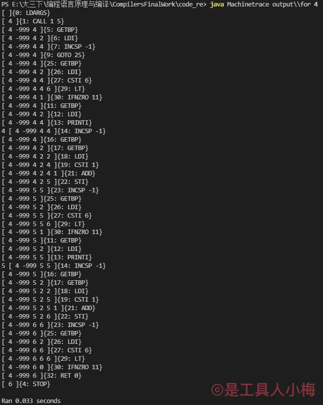

# [2020-2021学年第2学期](http://sigcc.gitee.io/plc2021/#/lab/proj.final?id=_2020-2021学年第2学期)

# [**实 验 报 告**](http://sigcc.gitee.io/plc2021/#/lab/proj.final?id=实-验-报-告)


- 课程名称:编程语言原理与编译
- 实验项目:期末大作业
- 专业班级 <u>计算机1802</u>
- 学生学号 <u>31801120 31801112</u>
- 学生姓名 <u>梅景添 项伟铭</u>
- 实验指导教师:郭鸣

## 项目简介

## 结构

- 前端：由F#语言编写
  - XMAbsyn.fs        抽象语法树
  - XMPar.fsy           fsyacc语法定义
  - XMLex.fsl            fslex词法定义
  - XMContcomp.fs  编译器
  - XM.fsproj             编译器项目文件

- 后端：有java语言编写

  - Machine.java       java后端

### 项目运行方式

```F#
# 编译编译器
dotnet build XM.fsproj

# 执行编译器
#r "nuget: FsLexYacc";;
#load "XMAbsyn.fs" "XMPar.fs" "XMLex.fs" "Debug.fs" "Parse.fs" "XMMachine.fs" "Backend.fs" "XMContcomp.fs" "ParseAndComp.fs";;
open ParseAndComp;;
Debug.debug <-  true;;
compileToFile (fromFile "test\\xxx.c") "output\\xxx";;

# 编译java后端
javac Machine.java

# 执行java后端
java Machine output\\xxx			-- 运行
java Machinetrace output\\xxx		-- 运行并输出堆栈信息
```

### 功能实现

- 实现各种形式注释注释

  测试代码

  ```c
  void main(int n) {
      /*这里是注释*/
      (*这里也是注释*)
      <!-- 这里也是注释 -->
      /*
          这是多行注释
      */
      (*
          这里也是多行注释
      *)
      <!--
          这里也是多行注释
      -->
      /* print n */
      (* print n *)
      // 这是单行注释
  }
  ```

  运行堆栈结果

  

  对比空函数的堆栈

  

- float类实现

  测试代码

  ```c
  void main(int n) {
      float x;
      x = 5.5;
      float y;
      y = 2.2;
      float z;
      z = x + y;
      print z;
      z = x - y;
      print z;
      z = x * y;
      print z;
      z = x / y;
      print z;
      return 0;
  }
  ```

  运行堆栈结果

  

- sleep 方法实现

  测试代码

  ```C
  void main(int n) {
      sleep(n);
  }
  ```

  运行堆栈图

  

- do-while实现

  测试代码

  ```C
  void main(int n) {
      int i;
      i = n - 3;
      do {
          print i;
          i = i + 1;
      } while(i < n);
  }
  ```

  运行堆栈图

  

- for循环实现

  测试代码

  ```c
  void main(int n) {
      for(n;n < 6;n = n + 1) {
          print n;
      }
  }
  ```

  运行堆栈图

  

  


| 姓名   | 学号     | 班级       | 任务 | 权重   |
| ------ | -------- | ---------- | ---- | ------ |
| Name   | No.      | Class      | Task | Factor |
| 梅景添 | 31801120 | 计算机1802 |      |        |
| 项伟铭 | 31801112 | 计算机1802 |      |        |

成员代码提交日志


1. 项目自评等级:(1-5) 请根据自己项目情况填写下表

| 词法                                      | 评分 | 备注 |      |
| ----------------------------------------- | ---- | ---- | ---- |
| 注释 // /**/                              | ⭐⭐⭐  |      |      |
| 字符串常量 单引号' ' 双引号 "" 三引号 ''' | ⭐    |      |      |
| 数值常量 0b0101， 八进制0o777 十六0xFFDA  | ⭐    |      |      |
| 语法                                      | ⭐    |      |      |
| if的多种方式 switch case                  | ⭐    |      |      |
| 循环 for / while / do while/ until        | ⭐    |      |      |
| for in 表达式                             |      |      |      |
|                                           |      |      |      |
| 语义                                      | ⭐    |      |      |
| 动态作用域，静态作用域                    | ⭐    |      |      |
| 闭包支持                                  |      |      |      |
| 模式匹配支持                              | ⭐    |      |      |
| 中间代码生成 AST，四元式，三元式，llvm    |      |      |      |
| 生成器 generator, yield                   | ⭐    |      |      |

1. 项目说明
   - 项目 是基于现有的xxx代码

     ```sh
     1. 添加注释 (**) // /**/
     2. 改进了while方法，实现了do-while功能
     ```

   - 项目 独立开发

     ```sh
     1. 完成了sleep()函数的开发
     2. 完成了float类的开发
     3. 
     ```
2. 解决技术要点说明
   - 解决  问题1，关键代码与步骤如下

     ```sh
     
     ```

   - 解决 xxx 问题2， 关键代码与步骤如下
     - 。。。
     - 。。。
3. 心得体会（结合自己情况具体说明）
   - 大项目开发过程心得
     - 遇到哪些困难，经历哪里过程，有哪些收获
     - 。。。
     - 。。。
   - 本课程建议
     - 课程难度方面，进度方面，课程内容，授课方式等，给出你的意见
     - 。。。
     - 。。。